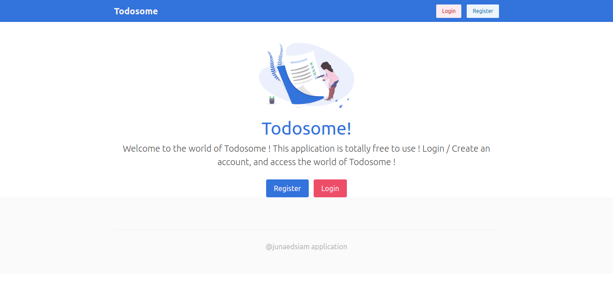
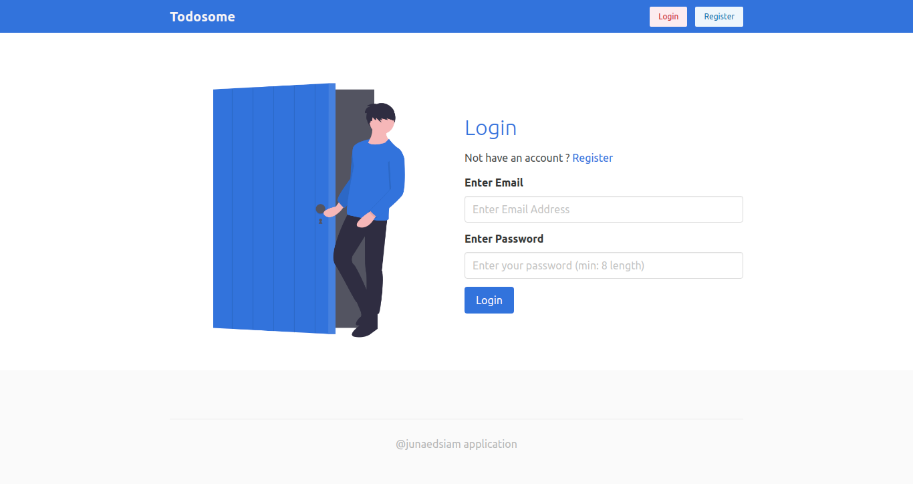
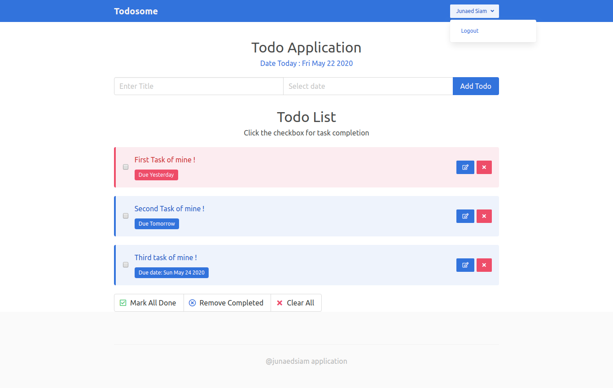

# A RESTFUL OAUTH Todo Application with Vue
This application is a frontend implmentation of a RESTFUL API, along with OAUTH 2.0 implementation ! A dedicated backend is needed in order to make this application work.
I have used **Laravel Passport** along with **Laravel API**.

For front - other than **VUEX** and **VUE-ROUTER**, **N-PROGRESS**, **VUEJS-DATEPICKER** has been used to make the UI better. And ofcourse  **LODASH** for making things easy. 

Feel free to check the full project ! 


## Home 
### Before Login view 


### Registration / login 



### Dashboard 



## API Endpoints 


```js
get('/todos') //For getting all todos
post('/todos') //for storing a todo 
delete('/todo/clear-all') //clear all todos 
delete('/todo/delete-done') //Delete only completed todos 
delete('/todo/{todo}') //delete a todo by id 
put('/todo/mark-all') // mark all as done 
put('/todo/{todo}') // update todo by id 
```


Here is a frontend implementation, based on the above API.

```js

const instance = axios.create({
    baseURL: 'http://your-api.test/api/',
    timeout: 10000,
    headers: {
      'Accept': 'application/json',
      'X-Requested-With':'XMLHttpRequest'
    }
});

```
Then based on that instance, we can create couple of functions. 

```js

//For adding todo
export const addTodo =(payload)=>{
    return instance.post('todos',payload)
}

//for removing one 
export const removeTodo =(payload)=>{
    return instance.delete(`todo/${payload}`,payload)
}

//for updating todo
export const updateTodo = (payload)=>{
  return instance.put(`todo/${payload.id}`,payload)

}

//for marking all todos as done 
export const markAllDone = ()=>{
  return instance.put(`todo/mark-all`,{})
}

//for deleting all completed todo
export const deleteDone = ()=>{
  return instance.delete('todo/delete-done',{})
}

//For clearing the board
export const clearAll = ()=>{
  return instance.delete('todo/clear-all',{})
}

```

